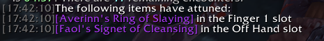

## Description ##

This addon will play a small sound and print an entry to chat when combat ends if an item has attuned during combat.

## Installation ##

Download this repository, then extract the `ScootsCombatAttuneWatch` subdirectory from the `src` directory into your `World of Warcraft/Interface/AddOns` directory.

## Screenshots ##

